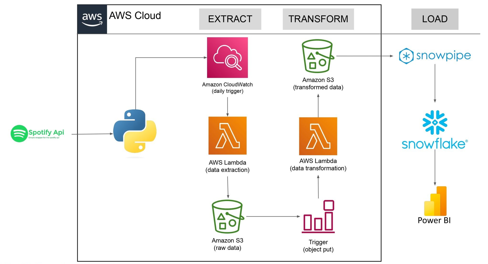

# Spotify Data Pipeline (ETL) Project

## Project Description:

This project automates the process of extracting raw data from the Spotify API, transforming it into a structured format, and loading it into Snowflake for easy analysis. Leveraging Python, AWS cloud services, and Snowflake, the pipeline ensures the data is well-organized and ready for meaningful analysis and visualization.

## Project Overview  

This project builds a data pipeline to extract, transform, and load Spotify API data using AWS, Python, and Snowflake, enabling efficient data processing for analysis.

## Project Architecture

## 1. Data Extraction

This project extracts data from the Spotify API using Python, capturing details about songs, albums, and artists. The Python code is deployed to AWS Lambda, offering a serverless environment for on-demand execution. A CloudWatch event trigger is configured to schedule data extraction at specified intervals. The extracted raw data is then stored in an AWS S3 bucket for further processing and analysis.

## 2. Data Transformation

A second AWS Lambda function is configured to transform the raw data stored in the S3 bucket. This function is triggered automatically via an event trigger whenever a new file is uploaded to the S3 bucket. During the transformation process, the raw data is cleaned, enriched, and formatted into structured CSV files for individual information categories, including albums, artists, and songs. The transformed data is then stored back in the S3 bucket for further use.

## 3. Data Loading  

A storage integration is set up to connect AWS S3 with Snowflake. Using Snowpipe, the process is automated so that whenever a new file is added to the specified S3 folder, Snowpipe automatically loads the data into a Snowflake table. This ensures seamless and real-time data ingestion for further analysis.

## Snowflake Table Snapshots

## Album Table

## Artist Table

## Song Table

## Snowflake Architecture Snapshot

## Tools and Technologies

**`AWS Lambda`**: Provides serverless computing for data extraction and transformation tasks, allowing code execution without provisioning or managing servers.  
**`AWS S3`**: Serves as a reliable, scalable storage solution for both raw and transformed data, ensuring secure and durable data storage.  
**`Amazon CloudWatch`**: Automates the scheduling of data extraction tasks, triggering them based on specified intervals or events.  
**`Amazon S3 Object Trigger`**: Automatically triggers Lambda functions when new data is uploaded to an S3 bucket folder, initiating the data transformation process.  
**`Snowflake Database`**: Loads the transformed data from S3 and enables querying of the dataset using SQL for analysis and reporting.
